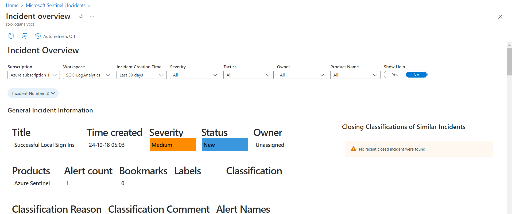

# Personal Security Operations Center (SOC) with Azure and Microsoft Sentinel

## Objective
To develop a cloud-based Security Operations Center (SOC) using Azure Virtual Machines and Microsoft Sentinel to simulate real-world security monitoring and threat detection processes. This project aims to demonstrate the configuration of an SIEM system, focusing on monitoring Remote Desktop Protocol (RDP) access, creating detection rules, and generating alerts for potential security threats.

### Skills Learned
- Configuring cloud-based virtual machines (Azure VM)
- Setting up and managing a Security Information and Event Management (SIEM) system with Microsoft Sentinel
- Monitoring network traffic and RDP access for security incidents
- Creating and fine-tuning detection rules for real-time threat alerting
- Working with Log Analytics Workspace for centralized data ingestion and monitoring

### Tools Used
- **Azure** (Virtual Machines, Log Analytics Workspace)
- **Microsoft Sentinel** (SIEM system)
- **RDP** (Remote Desktop Protocol)
- **Custom detection rules** in Microsoft Sentinel
- **Log Analytics** for data ingestion and analysis

## Steps
### 1. Set up Azure Virtual Machine
- Created a Windows-based Virtual Machine in Azure, using the free trial credits for deployment.
- Exposed RDP (Remote Desktop Protocol) access to simulate potential attacks and generate security events for monitoring.

*Ref 1: Azure Virtual Machine Overview Screenshot*

### 2. Configure Microsoft Sentinel
- Deployed Microsoft Sentinel on Azure and linked it to the Log Analytics Workspace to begin ingesting security event logs from the VM.
- Connected the VM’s security logs to Sentinel using Data Connectors, enabling log collection for analysis.

*Ref 2: Microsoft Sentinel Dashboard Screenshot*

### 3. Create Custom Detection Rules for RDP Sign-ins
- Configured custom detection rules in Microsoft Sentinel to monitor and alert on successful RDP sign-ins.
- The rules triggered real-time alerts, allowing for immediate detection of suspicious login attempts.

*Ref 3: Custom Detection Rule Setup Screenshot 1/2*

*Ref 3: Custom Detection Rule Setup Screenshot 2/2*

### 4. Real-Time Alerts and Analytics
- Demonstrated real-time incident generation in Microsoft Sentinel by attempting RDP logins. The successful attempts were flagged and alerted by the custom detection rules set up in the previous step.
- Incidents were generated for both successful logins via RDP, simulating a real-world security scenario (i.e. brute force attack).

*Ref 4: Microsoft Sentinel Analytics Screenshot*

### 5. Log Analytics Workspace Configuration
- Linked the Azure Virtual Machine to the Log Analytics Workspace to centralize data collection.
- Optimized data ingestion and monitoring workflows, ensuring that security events from the VM were available for analysis in real-time.

*Ref 5:  Microsoft Sentinel Incidents Screenshot*

*Ref 6: Incident Details Screenshot*

### 6. Integrate threat intelligence indicators through API calls for more comprehensive security monitoring
- The next series of events will entail setting up a threat intelligence feed and sending it into the SIEM utilizing Microsoft's prepackaged data connectors.
- To start, I installed the MISP2Sentinel Data Connector from the Content Hub.
- MISP is an open source threat intelligence platform. They utilize various threat indicators pulled from various partnered companies. The default (free) feeds are described in a JSON format. This will come into play when importing the data.
- 

*Ref 7: Install MISP2Sentinel Data Connector*

- To continue this process, I created a new VM to host a Docker container to import the data from MISP.
- Below is the overview of the VM for documentation purposes.

*Ref 8: VM2 Overview*

- I then set up SSH using Azure CLI to connect to the VM.

*Ref 9: Connect to VM2 through SSH*

- I then installed Docker using the following commands from the Docker website

*Ref 10: Docker Install Commands*

- The following screenshot verifies that the Docker Engine installation is successful by running the hello-world image.

*Ref 11: Verify Docker Installation*

- Next, I cloned the MISP Docker Portfolio using the command "$ git clone https://github.com/MISP/misp-docker"
- I then copied the template.env to .env and modified .env to set the value of the "BASE_URL" variable to the IP of the VM.
- I then performed the listed set of commands below from the GitHub portfolio

*Ref 12: Docker Run Commands*

- Under the Networking section of the VM (Ubuntu VM), I opened up port 443 to allow the connection to be established from anywhere.
  

*Ref 12: Open Port 443 on VM2*

Next, I logged into the MISP portal via a normal web browser on my host machine. Before any other steps, I first changed the default password used to login.
The next step was to enable the feeds on the website.
I started by coping the JSON file from the MISP GitHub of "https://github.com/MISP/MISP/blob/2.4/app/files/feed-metadata/defaults.json"

  

### 7.Implement automation for responding to specific alerts, reducing the need for manual intervention.
